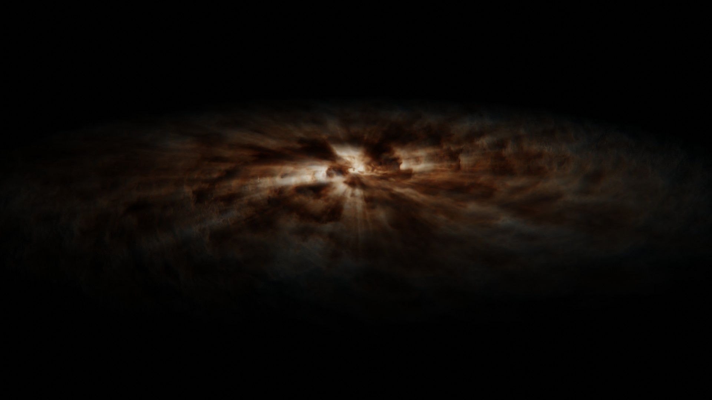

# Galaxy (coming soon)

## About

This addon allows you to create volumetric galaxies in Blender. The created nebula object contains a custom shader, which enables super fast render times.

Since the shader uses light samples within the shader itself, it will not iteract with seperate lightsources our other objects in the scene.

Furthermore, the nebula density adjusts automatically to the object scale, so that the appearance does not change. When scaling down, the overall density goes up, so that the realtic volume "particles" stay the same.

## Getting Started

After enabling the addon, you can add galaxies to the scene by using the "Add" button on the "Galaxy" panel which you can find at: 3d viewport -> n-tab -> Pro Atmo -> Galaxy.

When a nebula object is selected, you can change its appearence by tweaking the displayed properties.

## Properties

### Color

The color of the galaxy can be adjusted by using the following properties:

**Scattering Color:** When perfect white light is shining onto the particle, this color gets emitted.

**Scattering Intensity:** Scales the scattering color by this value.

**Absorbtion Color:** When perfect white light is shining onto the particle, this color gets absorbed.

**Absorbtion Intensity:** Scales the absorbtion color by this value.

### Density

The overall shape of the galaxy is defined by the density. The nebula uses a noise texture which gets rotated around the origin based on the distance to the origin.

**Rotation Factor**: How much the noise texture is getting rotated

### Light

## Render Settings

### Volume Step Rate

When Rendering volumetric objects, the render engine needs to convert the 3d data into 2d data, which is then displayed onto the 2d screen.

The volume step rate describes how many steps or sample points are used for that process. When an object has a lot of details in it, more steps are required for a good 2d approximation of that object.

Using smaller steps results into more sample points which can be used, which gives a higher quality.

By default the step rate is set to 1 which does not give optimal results. Depending on your system (gpu) you might want to set this value to 0.1 for the viewport and 0.01 for rendering.

### Max Volume Steps

If your using a low volume step rate, the number of steps can be very high for thicker parts of the object. You can limit the amount of steps by using the max volume step rate, so that you are not using unnessary steps.

Because the galaxy object is relativly thin geometry wise, you can decrease the max volume steps to around 100.

### Light Absorbtion Iterations

When a particle is rendered, it not only needs to know which density and color it has, but also how much light from the light source is reaching it. For that reasen, the shader calculates how much light is absorbed by the particles between the light source and itself. Using more iterations or steps for that process results into a better light approximation.

for the final render you should use the maximum amount of light absorbtion iterations.

### Render Samples

because the shader itself already does a lot of light calculations, you dont need much samples in order to get a high quality render. I would recommend using between 4 and 16 samples per frame.
