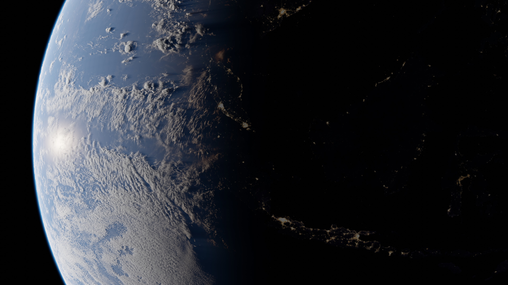

# Planet

## About

## Getting Started

After enabling the addon, you can add planets to the scene by using the "Add" button on the "Planet" panel which you can find at: 3d viewport -> n-tab -> Pro Atmo -> Planet.

When a planet object is selected, you can change its appearence by tweaking the properties displayed on the "Planet" panel.

## Properties

The "Planet" panel is divided into multiple subpanels each containing specific properties.

### Atmosphere

**Atmosphere Thickness**: The thickness of the atmosphere relativ to the planet

You can use two different atmospheric layers each using its own properties.

by default the layers are setup in a way which represents the atmosphere on the earth pretty accurate.

The first layer is set to values which represents the air particles in the atmosphere and the second layer is set to values which represents other "fog" or "dust" particles like water droplets.

**Density:** How dense the atmosphere is.

**Thickness:** Scales the atmosphere gradient.

**Scattering Color:** When perfect white light is shining onto the particle, this color gets emitted.

**Scattering Intensity:** Scales the scattering color by this value.

**Absorbtion Color:** When perfect white light is shining onto the particle, this color gets absorbed.

**Absorbtion Intensity:** Scales the absorbtion color by this value.

### Clouds

By default the clouds are generated using a equirectangular image. The image is a grayscale containing values between 0 and 1. 0 means that the clouds are not visible and 1 means that the clouds are using the maximum thickness.

**Height** This is the minimum height relativ to the atmosphere thickness at which the clouds are populated.

**Thickness** The thickness of the clouds relativ to the atmosphere thickness.

**Density:** How dense the clouds are.

**Scattering Color:** When perfect white light is shining onto the particle, this color gets emitted.

**Scattering Intensity:** Scales the scattering color by this value.

**Absorbtion Color:** When perfect white light is shining onto the particle, this color gets absorbed.

**Absorbtion Intensity:** Scales the absorbtion color by this value.

### Surface

**Albedo**: Color value which would be seen without surface reflextions and white light.

**Roughness**: Describes how much light is getting reflected in relation to the viewed angle.

**Specular**: How much light is getting reflected.

**Bump**: Simulates surface elevation by altering the position vector of the surface.

**Emission**: Emitts light independent from another light source.

### Rings

## Render Settings

### Volume Step Rate

When Rendering volumetric objects, the render engine needs to convert the 3d data into 2d data, which is then displayed onto the 2d screen.

The volume step rate describes how many steps or sample points are used for that process. When an object has a lot of details in it, more steps are required for a good 2d approximation of that object.

Using smaller steps results into more sample points which can be used, which gives a higher quality.

By default the step rate is set to 1 which does not give optimal results. Depending on your system (gpu) you might want to set this value to 0.1 for the viewport and 0.01 for rendering.

Because the atmosphere of an planet is really thin geometrie wise, you may want to also decrese the volume step rate for the material itself. this provides even more detail when the minimum amount for the scene is already reached. I would recooment using 0.1 for the atmosphere material.

### Max Volume Steps

If your using a low volume step rate, the number of steps can be very high for thicker parts of the object. You can limit the amount of steps by using the max volume step rate, so that you are not using unnessary steps.

Because the atmosphere of a planet is very thin geometrie wise, you typically dont need more the 100 steps for a good result.

### Light Absorbtion Iterations

When a particle is rendered, it not only needs to know which density and color it has, but also how much light from the light source is reaching it. For that reasen, the shader calculates how much light is absorbed by the particles between the light source and itself. Using more iterations or steps for that process results into a better light approximation.

for the final render you should use the maximum amount of light absorbtion iterations.

### Render Samples

because the shader itself already does a lot of light calculations, you dont need much samples in order to get a high quality render. I would recommend using between 4 and 16 samples per frame.
