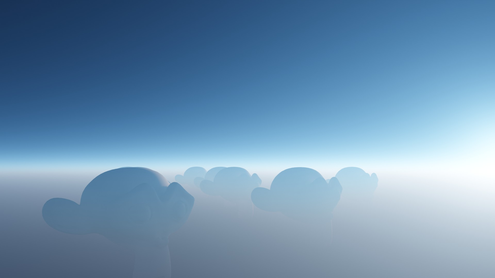

# Atmosphere (coming soon)

## About

This addon enables you to create a volumetric atmosphere using a custum shader. Using a realistic atmosphere is important when rendering large scenes.

The created atmopshere dont iteract with other light sources directly, because the light calculations are done in the shader itself. For that reason you can link the sun you are using in your scene to the shader, so that it is allways synced correctly.

## Getting Started

After enabling the addon, you can add atmospheres to the scene by using the "Add" button on the "Atmosphere" panel which you can find at: 3d viewport -> n-tab -> Pro Atmo -> Atmosphere.

When a atmosphere object is selected, you can change its appearence by tweaking the displayed properties.

## Properties

### Layers

You can use two different atmospheric layers each using its own properties.

by default the layers are setup in a way which represents the atmosphere on the earth pretty accurate.

The first layer is set to values which represents the air particles in the atmosphere and the second layer is set to values which represents other "fog" or "dust" particles like water droplets.

**Density:** How dense the atmosphere is.

**Thickness:** Scales the atmosphere gradient.

**Scattering Color:** When perfect white light is shining onto the particle, this color gets emitted.

**Scattering Intensity:** Scales the scattering color by this value.

**Absorbtion Color:** When perfect white light is shining onto the particle, this color gets absorbed.

**Absorbtion Intensity:** Scales the absorbtion color by this value.

### Sun

If you are using a sun as a primary light source in your scene, you can link this sun to the shader, by selecting this sun as **Scene Sun**.

If you now want to change the intensity or the color of the sun, you need to use the following properties, so that the changes are updated for the sun and the atmosphere at the same time.

## Render Settings

### Max Volume Steps

Since the atmosphere itself dont contain a lot of detail, you can decrease the max volume steps to around 25.

### Volume Step Rate

Because the atmosphere is very thin geomtrie wise, you may want to decrease the volume step rate to around 0.1 for renderings.
