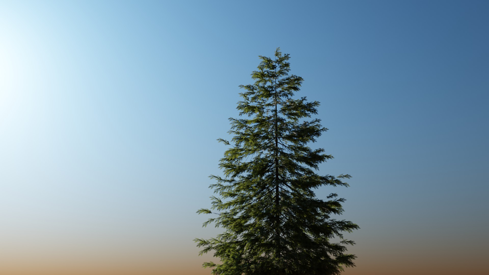

# Sky

## About

This addon allows you to create fast and realistic sky lighting and sky background in Blender. The sky uses a custom shader, which is very adjustable.

The created sky is not volumetric, meaning it is only a background in the scene using the world shader.

## Getting Started

After enabling the addon, you can add a sky to the scene by using the "Add" button on the "Sky" panel which you can find at: 3d viewport -> n-tab -> Pro Atmo -> Sky.

When a sky world is selected, you can change its appearence by tweaking the displayed properties.

## Properties

### Layers

You can use two different atmospheric layers each using its own properties.

by default the layers are setup in a way which represents the atmosphere on the earth pretty accurate.

The first layer is set to values which represents the air particles in the atmosphere and the second layer is set to values which represents other "fog" or "dust" particles like water droplets.

**Density:** How dense the atmosphere is.

**Thickness:** Scales the atmosphere gradient.

**Scattering Color:** When perfect white light is shining onto the particle, this color gets emitted.

**Scattering Intensity:** Scales the scattering color by this value.

**Absorbtion Color:** When perfect white light is shining onto the particle, this color gets absorbed.

**Absorbtion Intensity:** Scales the absorbtion color by this value.

### Sun

## Render Settings

Because the sky is basically just a dynamic background image, it is fully rendered after just one sample. You can handle the render settings the same just as you would do when using an hdri image texture as a world shader.
